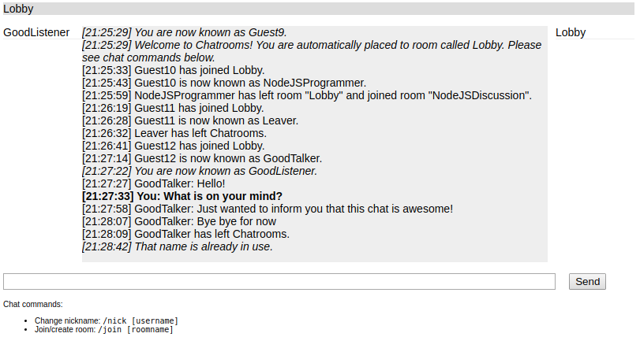

[migrating_socketio]:https://socket.io/docs/migrating-from-0-9/
[mime]:https://www.npmjs.com/package/mime
[defaultroom_socketio]:https://socket.io/docs/rooms-and-namespaces/#Default-room

# Chatrooms
Simple web-based chatroom-application based and improved on the design from book Node.js in Action, First Edition by Mike Cantelon, Marc Harter, T.J. Holowaychuk and Nathan Rajlich.

Changes from the original design:
* Security:
    * [Migrated][migrating_socketio] to current up-to-date (2.2.0) version of Socket.IO (was: 0.9.6).
    * [Mime][mime] upgraded from 1.2.7 to current up-to-date (2.4.0) version.
    * Migration changed the [Default room][defaultroom_socketio] behavior. Socket.IO now creates a room with random, unguessable, unique identifier. Fixed this by leaving from the room when user connects

* Features:
    * Added client-side timestamps to messages (tested this with two browser that were set to two different time zones)
    * Block users trying to join same room again and inform about it on chat.
    * Differentiate first time connection with a function when joining the lobby, rather than using default room change-function
    * Display user names currently in current chat room
    * Added autoscrolling for application messages
    * Added autoscrolling for other users messages
    * Added highlight for your own messages
    * Added notification of users leaving a room
       * Display to which room was changed
    * Add notification of users leaving the chat

An example screenshot of the program running:

